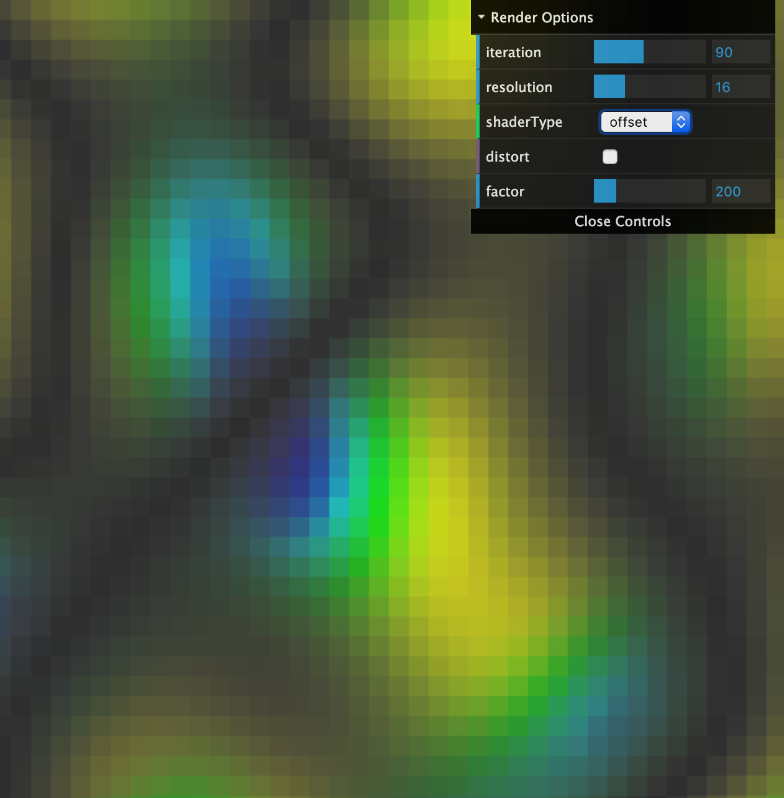

# Perlin and Simplex Noise

  A rite of passage for any JavaScript enthusiast - Perlin and Simplex noise, the foundation of all random fun animation things. My goal was to learn the how and why of the two formulas. I kind of get it - not a math person here, however it was good experience converting, researching and developing these examples.

    Current Mapping --> ```index.js``` --> (render file) ```HSLRender.js``` (or just about any other Render file in src)


  This is a port of Ken Perlin's Java code. The
  original Java code is at http://cs.nyu.edu/%7Eperlin/noise/.
  SimplexNoise document http://staffwww.itn.liu.se/~stegu/simplexnoise/simplexnoise.pdf

## Change Log
  * Updated P5 to 0.7.3 / Webpack 4
  * HSL Render version
  * Added DAT.gui
  * Updated Functions - Improved performance - adapted from online
  * Added Animation - tweaking functions still...
  * Simplex Noise functions - much faster than Perlin
  * Initial Commit - Basic formula found online.

## Run the example
  Requires Node and Yarn to be installed for build and development.

  *Open a terminal window and type the following for local webpack dev server...*
  ```bash
  $ yarn install
  $ yarn dev
  ```
  open http://localhost:2020